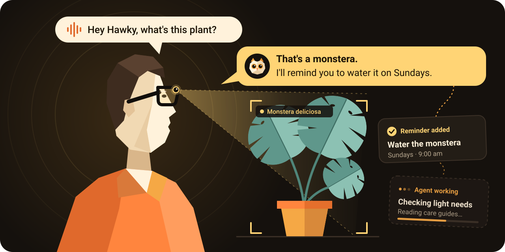
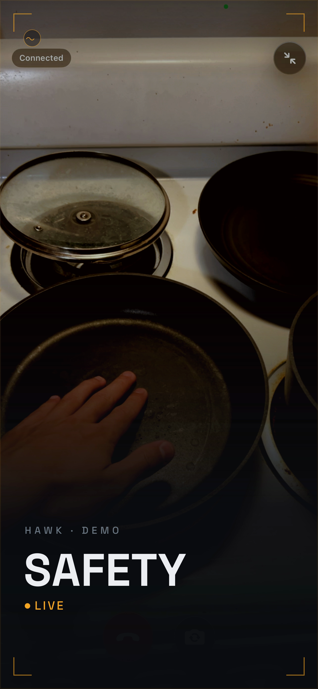
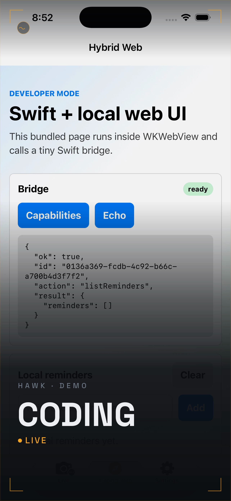
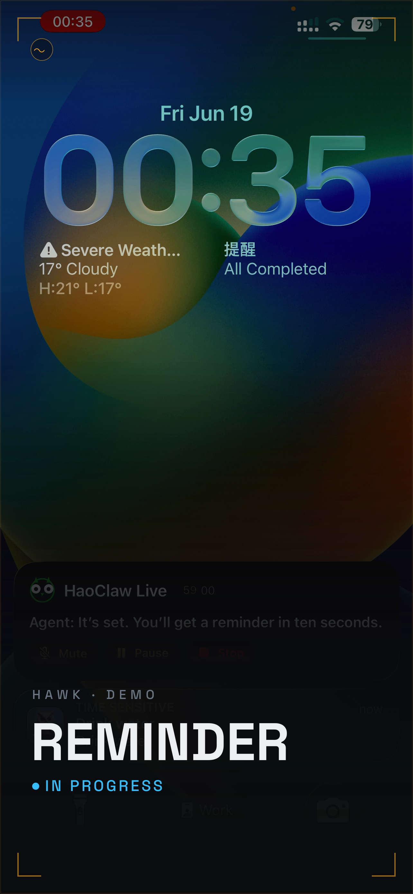
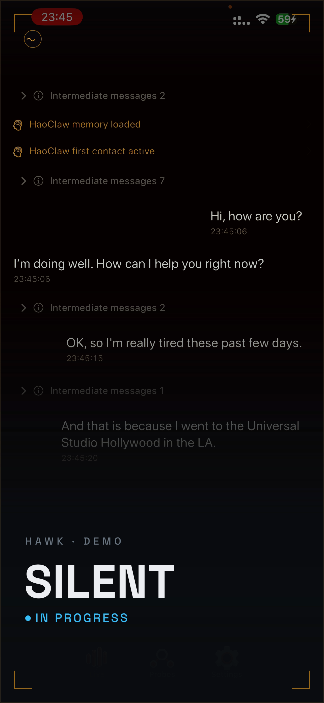
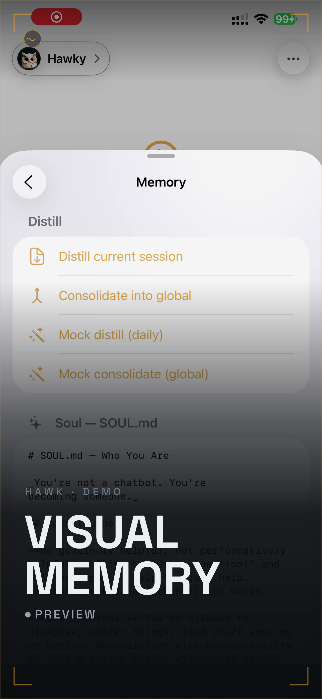
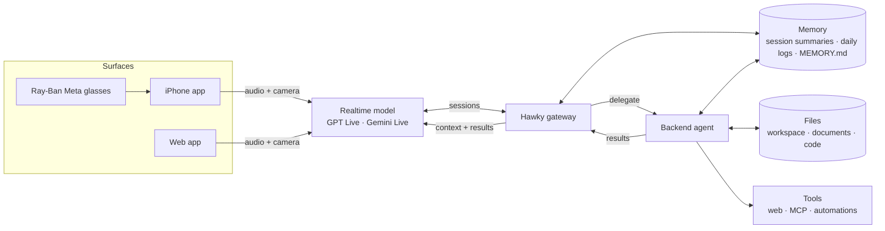

<div align="center">


# Hawky

**An open-source personal agent with realtime interactivity on your phone or Meta Rayban glasses.**

**[Try Hawky now at app.hawky.live →](https://app.hawky.live/)**

Hawky is a personal assistant agent running on top of interactive models as a frontend. It remembers what you see, talks to you in real time, and delegate long runnnig works to backend agent with long-horizon memory and tools. Use it as a web app, an iphone app, and even with your Ray-Ban Meta glasses.

<p align="center">
<a href="https://www.hawky.live/"></a>
<a href="https://app.hawky.live/"></a>
<a href="https://github.com/hao-ai-lab/hawky"></a>
<a href="https://github.com/hao-ai-lab/hawky/actions/workflows/ci.yml"></a>
<a href="LICENSE"></a>
</p>

[Quick start](#quick-start) · [Demos](#demos) · [How it works](#how-it-works) · [Contributing](#contributing) · [Citation](#citation)

<a href="https://www.hawky.live/"></a>

</div>

## What it is

Most voice assistants forget everything once the call ends. Hawky separates the live
conversation from the work behind it:

- A **realtime model** (GPT Live, Gemini Live and more) handles the conversation: natural
  turn-taking, interruption, and live camera context from your glasses or phone.
- The **Hawky gateway** holds your sessions, memory, and tasks. If you ask for
  something that takes longer than a sentence, the gateway gives it to a
  **backend agent** that has tools, files, and automations.
- The results come back into the conversation. Longer tasks keeps going after the call ends.

## Features

| Features | Description |
| --- | --- |
| **Live** | Open a conversation with video and audio. Support closed-source providers (OpenAI Realtime, GPT-Live, Gemini Live) and open-source models ([JoyAI-interactive](https://github.com/jd-opensource/JoyAI-VL-Interaction), [Realtime-Venus-Omni](https://github.com/inclusionAI/Realtime-Venus/tree/main)). You can switch models mid-conversation without losing memory. |
| **Meta Ray-Ban glasses** | Streams first-person video and audio from Meta glasses to the agent. *Require the iPhone app to support this functionality.* |
| **iPhone app** | Native SwiftUI client for Live, chat, and other functionalities. Connects to the same gateway for shared states. |
| **Web app** | Run the same web app on other browser, on desktop or phone. *Web app does not support ray-ban glasses.* |
| **Background work** | Delegate complex tasks on the gateway and report their results while you keep talking, or the next time you connect. |
| **Agentic Memory** | Conversation and memory carries over to the agent. |

Camera snapshots and session events can be archived. Full microphone, reply-audio,
and video recording for searchable visual memory is planned but not complete yet.

## Demos

<table>
  <tr>
    <td align="center" width="33%"><a href="website/assets/demo-cocktail.mp4"></a><br /><b>Cocktail party</b><br />Picks out who's talking in a noisy room and quietly briefs you.</td>
    <td align="center" width="33%"><a href="website/assets/demo-safety.mp4"></a><br /><b>Safety</b><br />Watches your surroundings and warns you about hazards.</td>
    <td align="center" width="33%"><a href="website/assets/demo-coding.mp4"></a><br /><b>Coding</b><br />Ask out loud for a feature; the backend agent writes it while you keep moving.</td>
  </tr>
  <tr>
    <td align="center"><a href="website/assets/demo-reminder.mp4"></a><br /><b>Reminders</b> · in progress<br />Notices commitments you make and reminds you at the right moment.</td>
    <td align="center"><a href="website/assets/demo-silent.mp4"></a><br /><b>Silent mode</b><br />Reads the scene and helps without speaking.</td>
    <td align="center"><a href="website/assets/demo-memory.mp4"></a><br /><b>Visual memory</b><br />"Where di I lost my key?"</td>
  </tr>
</table>


See more at [hawky.live](https://www.hawky.live/).

## Quick start

### Use the hosted app

1. Open **[app.hawky.live](https://app.hawky.live/)** and sign up.
2. Go to **Live**, allow the microphone and camera, and start talking.
3. If you're asked for a key, add your own OpenAI key in **Settings → OpenAI key**.
   It stays in your browser and is only used to create short-lived realtime sessions. We do **not** store your API key.

### Run your own gateway

Requires [Bun](https://bun.sh) 1.3 or later.

```bash
git clone https://github.com/hao-ai-lab/hawky.git
cd hawky
bun install
bun run gateway
```

On first run, the gateway asks for an Anthropic API key for the backend agent. Then, in another terminal:

```bash
cd web-ios && bun install && bun run dev
```

Open **http://localhost:5273**, add a realtime key in **Settings**, and press
**Live**. Camera and microphone need a secure context, so use `localhost` or HTTPS
rather than a plain-HTTP LAN address.

### iPhone and Ray-Ban Meta glasses

The iOS app is in [`ios/`](ios/) and needs Xcode and a reachable Hawky gateway.

```bash
bun run ios:generate        # regenerate ios/hawky.xcodeproj from ios/project.yml
bun run ios:install-device  # build, install, and launch on a connected iPhone
```

To use glasses, open **Ray-Ban Meta** from Hawky's Live screen and tap **Register
glasses**. This opens the Meta AI app, and you only need to do it once per device. Then choose
Ray-Ban as the video source, and the realtime model sees what you see.

### Things to try

1. Point the camera at something on your desk and ask what it is.
2. Ask for something slow ("research the best trail near me for Saturday"), then
   keep chatting. The task card updates while you talk.
3. End the call before the task finishes, then start a new one. Hawky still
   remembers the conversation and tells you what the task found.
4. Switch the Live model in settings mid-conversation. The conversation carries over.

## How it works



The realtime model handles the live moment. The gateway is a long-lived process
that owns sessions, tasks, and permissions, so any client can disconnect and
reconnect without losing work. Everything talks to it over one WebSocket
(JSON-RPC on port 4242).

- **Memory** is what Hawky knows about you and your conversations. The gateway
  keeps a rolling summary of each session, rolls those summaries into daily logs,
  and merges the daily logs into long-term `MEMORY.md`. That's how a new call
  starts with context. It's searchable by keyword and by meaning.
- **Files** are the agent's working space (`~/.hawky/workspace`): documents it
  reads, notes it writes, and code it edits for longer tasks.
- **Tools** let the backend agent act: web search and fetch, MCP servers,
  scheduled jobs, and skills.

Deeper reading: [Live providers and delegation](docs/development/live-providers.md) ·
[Realtime delegation](docs/realtime-delegation.md) ·
[Rolling session memory](docs/rolling-session-memory.md)

| Path | What |
| --- | --- |
| `src/` | Core runtime: agent loop, providers (Anthropic, OpenAI, Vertex), tools, memory, skills, MCP, and the gateway. |
| `src/gateway/` | WebSocket hub: device auth, permissions, cron and heartbeat, media ingest, live-provider brokers. |
| `src/live/` | Live provider contracts, adapters, and the delegation coordinator. |
| `src/ambient/` | Ambient engine: intentions, delivery modes, geofence and cron activation, reminders. |
| `web-ios/` | The Hawky web app (Live, Chat, People, Memory, Settings). |
| `ios/` | Native iPhone app (SwiftUI) with Ray-Ban Meta glasses support. |
| `services/` | Python sidecars (face recognition). |
| `website/` | [hawky.live](https://www.hawky.live/) landing page and demo media. |

## Configuration

The gateway reads `~/.hawky/config.json`, created on first run. Environment variables
override it:

| Variable | Used for |
| --- | --- |
| `ANTHROPIC_API_KEY` | Backend agent (required unless another provider is configured) |
| `OPENAI_API_KEY` | OpenAI Realtime and GPT-Live sessions minted by the gateway |
| `GEMINI_API_KEY` | Gemini Live |
| `HAWKY_LOG_LEVEL` | `silent` · `error` · `warn` · `info` · `debug` · `trace` |

Keys stay on the gateway. A browser can supply its own key, which is sent over the
authenticated connection only to create realtime sessions.

## Development

```bash
bun run typecheck
bun run test                 # core unit tests
bun run test:integration
cd web-ios && bun run test   # web app tests
bun run ios:build-sim        # iOS simulator build
```

Manual Live checks: [Live provider verification](docs/development/live-providers.md#verification-and-manual-checks).

## Contributing

Issues and pull requests are welcome. Read [AGENTS.md](AGENTS.md) first. It covers the
repo map, commit policy (conventional commits, human co-authors only), and the PR
format that CI checks.

## Citation

```bibtex
@software{hawk_ambient_agent,
  title  = {Hawky: An Ambient AI Agent},
  author = {The Hawky Team},
  year   = {2026},
  url    = {https://github.com/hao-ai-lab/hawky}
}
```

## License

[Apache-2.0](LICENSE).
