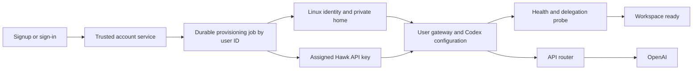

# Signup to a private workspace and Codex delegate

Status: proposed. This PR only enables issued Hawk keys in existing OpenAI request paths; it does not automatically provision new accounts, assign keys, or configure Codex.

## What already exists

- Password registration and Google sign-in create approved application users and redirect them to a workspace.
- `src/gateway/workspace-provisioner.ts` invokes an operator-configured provisioning command. Today the server invokes it from admin approval, not registration or Google sign-in.
- `src/gateway/workspace-registry.ts` maps authenticated users to local gateway endpoints.
- `src/gateway/external-agent-runtime.ts` starts `codex exec` for delegated work and resumes existing runtime conversations.
- Private deployment scripts create Linux users, home directories and gateway processes. They require changes before becoming the automatic signup path.

## User experience

Sign up with Google or an allowed email/password, see "Setting up your workspace", and enter Hawk once both the gateway and a Codex probe work. No separate Codex login or API-key copying is required. The delegate uses API billing through the operator's router, not the operator's personal ChatGPT login.

If setup fails, keep the account and show a retry action. Signing in again resumes setup. Never redirect an unprovisioned user into the shared/default user's workspace.



## One provisioning operation

Password signup, Google signup, explicit approval, and login for an incomplete account all call `ensureUserProvisioned(userId)`. It queues work and returns the existing state; it does not run privileged shell commands inside the HTTP request.

Only approved, enabled accounts are eligible. Derive identities, directories and endpoints from the stable server-assigned user ID, not caller-supplied paths, ports, usernames, emails or shell fragments. Preserve existing mappings when migrating older accounts.

A trusted worker performs these steps:

1. **Reserve identity.** Lock the provisioning record and reserve a unique Linux username, UID, gateway port and workspace path. Use a transactional registry rather than racing read/modify/write JSON operations. The worker has only the root privileges needed for account setup; user gateways run without sudo.
2. **Create private storage.** Create the Linux user/group and home with `0700`, set `umask 077`, and create `workspace/`, `.hawky/`, `.codex/` and private logs. Secrets use `0600`. Do not copy the operator's home, authentication database, Codex state, or login-signing key.
3. **Assign API authorization.** A trusted router-management operation reserves one key for this user ID, writes that user's credential atomically, and activates it. A unique user-to-key mapping makes retries idempotent. The router derives the user from the credential, never from a caller-supplied subject header. No shared default-key fallback.
4. **Configure and start.** Write gateway and Codex settings, supply an allowlisted environment, and start the gateway under its Linux identity using a process supervisor. Select Codex as this user's default delegation runtime. Register the authenticated workspace route only after verification.
5. **Verify readiness.** Check gateway health, then run a bounded Codex task as the actual Linux user through the API router. The task reports its working directory and reads a private marker in its workspace. Mark ready only after successful completion; retain the failed step for retry.

The existing 120-second command wrapper is not a durable job runner. Add a persistent job record, a lease for the worker, and restart recovery rather than relying on a long HTTP request or an in-memory promise.

## State and retries

Store `user_id`, `status`, `step`, `linux_user`, `workspace_path`, `gateway_port`, `key_id`, `attempt`, `lease_until`, `next_retry_at`, `last_error_code`, `config_version`, and `ready_at` in an operator-only transactional database. Never put plaintext secrets in job events or error messages.

```text
pending -> provisioning -> verifying -> ready
                |              |
                +---- failed --+ -> retry from last completed step
any state -> disabled
```

Each step verifies the existing resource before creating it. Concurrent signup/login requests produce one job and one key. A worker restart reclaims an expired lease and resumes. Failure retains the user's directory and reserved identity; it does not wipe files or allocate a replacement key silently. Retries use bounded backoff, with a visible terminal failure after the configured attempt limit.

Check account state again before activating a key, starting a process, or publishing a route. Disabling an account revokes its key, closes active authorized streams, removes routing access and stops its gateway/agent processes; it does not delete its data. Router revocation must cover existing connections, not only new requests.

## Codex setup

Install one operator-managed Codex executable for the pod. Every user gets a separate `CODEX_HOME`, model configuration and conversation history. An upgrade updates the shared executable, not users' homes.

The provisioning template writes the chosen, API-accessible model explicitly. Do not inherit a model from the operator's personal configuration. Model selection is an operator setting, checked with the installed CLI and upstream account before enabling signup.

Illustrative per-user `.codex/config.toml` (the worker replaces the model and base URL placeholders):

```toml
model = "<verified-api-model>"
model_provider = "hawk"

[model_providers.hawk]
name = "Hawk"
base_url = "<configured-router-base-url>/v1"
env_key = "HAWKY_USER_API_KEY"
wire_api = "responses"
requires_openai_auth = false
supports_websockets = false
```

Start with HTTP/SSE Responses for Codex; enable Responses WebSockets only after a dedicated Codex compatibility test. Realtime WebSocket support alone does not establish Codex compatibility. These provider fields are documented in the [official Codex configuration reference](https://developers.openai.com/codex/config-reference/).

The runtime explicitly sets `HOME`, `CODEX_HOME`, `HAWKY_HOME`, a controlled `PATH`, the user's Hawk key and approved runtime settings. Working directory is their private workspace. Do not use `runuser --preserve-environment` on the deployment environment. No operator OAuth tokens, Cloudflare/RunPod credentials, shared signing secrets, or another user's keys are inherited.

Keep the existing delegation lifecycle: task IDs are scoped to the authenticated owner, each independent task gets its own runtime conversation, and a continuation may only resume that owner's recorded Codex session. Codex results flow into the existing task card and live-response delivery path. Spawn agent processes on demand; an idle signup need not leave a Codex process running.

## Authentication and key custody

The trusted front door owns browser login sessions and the global signing secret. It authenticates the browser, looks up the user's workspace server-side and proxies to the selected gateway using a distinct per-workspace credential. Strip browser-supplied internal identity headers. The workspace gateway rejects requests without its own credential, even when reached directly on localhost. Never copy the global signing key into a user-owned home.

The key allocator must run outside user workspaces. The initial router registry stores only key hashes, so it cannot return an existing plaintext key on retry. Before automatic allocation, import the issuance pool into an operator-only encrypted credential store, or generate per-user credentials there on demand. Persist the user mapping and encrypted credential transactionally. If delivery fails after allocation, retrieve the same credential securely and retry. Do not copy the full issuance pool into a user's directory.

A user may read their own Hawk key through an agent. Treat it as an exportable, revocable credential with a user-specific quota, not as a hidden platform secret. The upstream provider key stays on the trusted router. The router must enforce ownership for stored response IDs, continuation references and live-session IDs; unique bearer keys alone do not partition an upstream account.

## Isolation level for the first release

Use distinct non-root Linux identities and private directory permissions on the shared pod. Per-user containers are not required for this phase. This protects against ordinary cross-user file access; it is not isolation against a host/kernel compromise, and administrators retain access.

Also give each user private temporary storage, avoid shared writable executable/configuration directories, and apply process/file-descriptor/disk limits. Shared localhost services still need authentication and user scoping. Separating UIDs does not isolate network ports or prevent access to shared service data.

## Implementation boundaries

| Public product repository | Private deployment repository |
|---|---|
| Signup/login hooks and provisioning status UI/API | Linux account and private-directory setup |
| Job/state contract and authenticated route gating | Credential allocation, supervisor and runtime templates |
| Per-user delegate selection and owner checks | Pod addresses, secret storage and operator configuration |
| Tests and generic design | Deployment scripts and operational runbooks |

No pod IDs, private topology, issuance files or credentials belong in the public PR.

## Acceptance tests

1. Fresh password and Google signups each reach a usable workspace and finish a real delegated file-read task without a Codex login prompt.
2. Concurrent signup/login retries produce one Linux identity, one route and one key; restart the worker midway and verify it resumes.
3. User A's actual agent cannot read user B's key, workspace, Codex history or global secrets; A's requests cannot select B's gateway/runtime session or upstream resource IDs.
4. Router outage, exhausted key pool and model/CLI failure preserve the account and show retryable setup status. No redirect to the default workspace.
5. Disable during setup and after readiness: no late activation, no new tasks, active streams/processes stop, and user files remain intact.

Estimated implementation: 2-3 engineering days including the private deploy changes and a two-user live verification. This PR is the router integration and design only.
